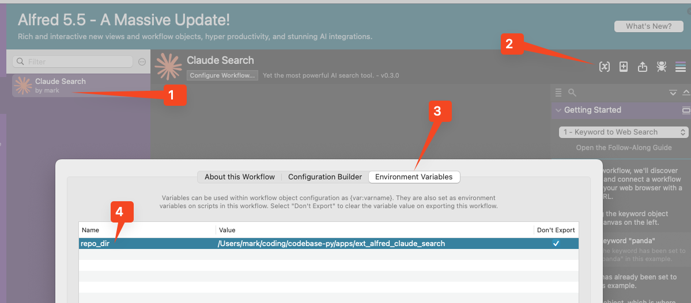

# Alfred Extension - Claude Search [ARCHIVED]

> **Note**: This project is now archived as of January 2025. The functionality provided by this Alfred extension is now natively available in macOS through the Claude app's shortcut (Option + Space). We recommend using the native shortcut instead.

## Effect


## Usage

Step 1. **MUST** ensure you have logged in your claude in your default browser

Step 2. prepare env
```shell
brew install poetry
poetry shell
poetry install
```

Step 3. test script, grant any permissions the programme needs (i.e. automation, record.)
```shell
python src/core-web-input.py "hello world"
```

Step 4. install alfred workflow

1. double click [Claude Search.alfred0workflow](scripts/alfred/Claude Search.alfredworkflow)
2. add into your fallback search options(`Features - Default Results - Fallbacks - Setup fallback results - + - Workflow Trigger - Search Claude for '{query}'`)

Step 5. config environment variable


